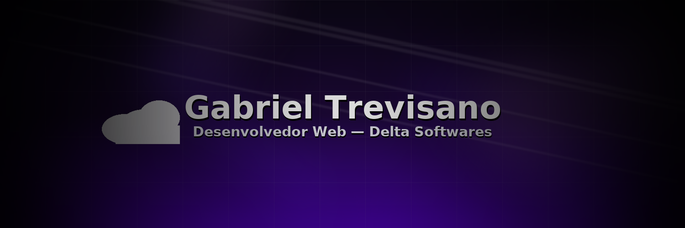

  

  
  
  

<h2 align="center">Crio soluções web com foco em gestão, produtividade e uma pegada de infra bem feita.</h2>

  
  &nbsp;&nbsp;
  

### Destaques
<table>
  <tr>
    <td width="33%">
      <h3>DataReg</h3>
      
ERP para PMEs: usuários, relatórios, inventário, recebíveis.

      

        
      

    </td>
    <td width="33%">
      <h3>WorkGrid</h3>
      
Planejamento, times e tarefas com foco em produtividade.

      

        
      

    </td>
    <td width="33%">
      <h3>DeltaVault</h3>
      
Repositório interno de downloads com permissões e auditoria.

      

        
      

    </td>
  </tr>
</table>

### Stack

  
  
  
  
  
  
  
  
  
  

### Projetos
<table>
  <tr>
    <td>
      <b>DataReg</b> 
      ERP para PMEs com módulos de gestão e relatórios.  
      
      
    </td>
  </tr>
</table>

  
<b>Mais sobre mim</b>

   
  <ul>
    <li>Foco em unir desenvolvimento + infraestrutura.</li>
    <li>Experiência com XAMPP, MySQL/MariaDB e servidores Windows.</li>
    <li>Curioso por automações, dashboards e gestão de dados.</li>
  </ul>

### Estatísticas

  
  

### Contato

